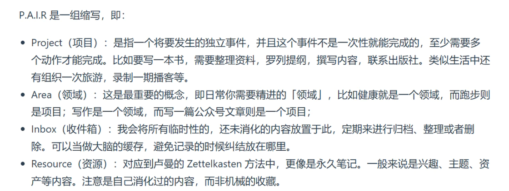

# briefguo.github.io

- [相关链接](https://sspai.com/post/86051)

## 项目
### 个人游戏工程 WT
一个个人开发的游戏项目，探索游戏设计与开发的乐趣。
### 身体改造计划
记录和分享身体改造的过程和心得，追求健康与自我提升。

## 领域
### 哲思
- 人生、哲学、心理学、社会学
探索人生的意义，哲学的思考，心理学的奥秘和社会学的现象。
### 软件工程
- 产品、设计、研发、项目管理
涵盖从产品构思到设计、研发和项目管理的完整软件工程流程。
### 经济
- 投资、理财、创业
分享投资理财的经验和创业的心得，探索经济领域的机会。
### 游戏
- 玩法、设计、开发、运营
- 动画、音乐、美术
深入探讨游戏的玩法设计、开发过程、运营策略以及动画、音乐和美术的创作。
### 健康
- 身体、心理、营养、运动
关注身体健康、心理健康、营养知识和运动健身的综合指南。

## 收件箱
> 外部信息
收集和整理外部获取的信息和资源。

## 资源
> 内化资产
将外部信息转化为内在的知识和资产。
