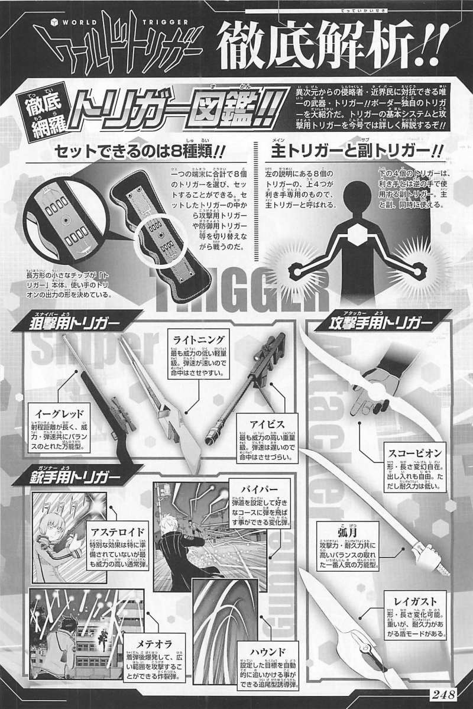

# 游戏玩法

## 1. 基础战斗机制

### 1.1 触发器系统 (Trigger System)

玩家可以在战斗中自由选择和切换不同的触发器，每个触发器代表不同的武器或能力。
示例触发器：Kogetsu（近战武器）、Pistol（远程武器）、Shield（防御）、Grasshopper（位移）。
每个触发器都有独特的技能和使用方式，玩家需要根据战场情况灵活选择和组合触发器。

触发器效果和冷却时间：确保每个触发器的技能效果与冷却时间设置合理，以防止某一触发器过于强大或过于弱小。
触发器组合：允许玩家在战斗中组合不同的触发器技能，以便产生多样化的战术选择。比如，玩家可以使用Kogetsu进行近战攻击后，迅速切换到Pistol进行远程打击。
视觉和音效反馈：为每个触发器的技能添加独特的视觉效果和音效，使其在战斗中更具表现力。

Dao
- 刀

Jian
- 剑
  - 单手剑 太极剑 武当剑 独孤九剑
  - 双手剑 螳螂剑 方寸剑
  - 重剑 大剑无锋
  - 日本剑
  - 欧洲剑

- 火器

剑术的迷人之处在于
力量与技巧
艺术性
心态与精神修养
对抗与平衡的艺术
历史与文化的传承
自我提升与修行
象征与哲学

1. 打击感与反馈强化 精准的打击反馈 视觉特效 音效设计 触觉反馈
2. 流畅的剑术连招系统  连击与连招系统  取消机制与反应性  战斗中的动作过渡断。
3. 敌人的反应与反馈  敌人受击的表现果。  破甲与弱点系统
4. 技能与强化  剑术技能树给玩家长期的目标和动力。  剑术能力强化
5. 游戏机制设计  精确的防御与反击系统感。  攻击的物理表现  剑招风格的多样性的乐趣。
6. 故事驱动与情感共鸣  情节引导的剑术提升  剑术与角色性格的结合暴力的横斩。
7. 视觉表现与动画流畅性  剑术动作的细腻设计  镜头与特写配合
8. 玩家成就与奖励  评分系统巧，追求更高的成就。  战斗回放与教学

### 1.2 移动方式
- 基础移动：包括走、跑、跳等基本动作。确保角色的移动流畅且响应迅速。
- 高级移动：如冲刺等，可以增加战斗的策略深度。考虑如何在不同的触发器使用状态下实施这些高级移动。
- 环境互动：允许角色与环境互动，如攀爬障碍物、利用掩体等。

### 1.3 攻击、防御与闪避

#### 攻击：
- 普通攻击：
  - 轻攻击，轻攻击快但伤害低
  - 重攻击，重攻击伤害高但速度慢。
- 连击（Combo）：设定连击系统，以鼓励玩家使用连续攻击来增加伤害。
- 特殊攻击：如跳跃攻击、冲刺攻击、双持攻击等。确保这些攻击有独特的动画和效果。

双手剑

抽帶雲抹提，點崩撩刺擊。
絞截斬格劈，挑撥掛錯洗。

**攻击类**
- Z 垂直方向
  - 劈、挑
  - 撩。持剑向上
- Y 水平方向
  - 斩
- X 纵深方向
  - 刺。纵深长、速度慢
  - 点。纵深最短、速度快
  - 击。纵深适当、能击落武器
  - 绞。

**身法类**
提。Z 垂直方向。持剑向上，适合击中面门
抽。Z 垂直方向。准备架势，帅就完事了
带。持剑移动
云。Y 水平方向。持剑于头顶舞动，范围360度
抹。Y 水平方向。持剑于中部舞动，范围180度
拨。Y 水平方向。持剑于胸前舞动，如鱼尾抖动，范围60度
错。Y 水平方向。持剑于中线左右短砍，利用剑身在正前方应对攻击，方便杀出重围
掛。身法，迅速转身击人背面
洗。大剑花。谁说双手剑就不能舞了

**格挡类**
崩。应对斩击。以硬碰硬，释放得当，能震落武器
截。利用剑尖力量。应对斩击，化掉斩击，接上攻击技
格。利用剑身力量。应对斩击、劈击、突刺皆有效果

抽撩洗

攻击分为三个阶段
- 引导
- 攻击
- 恢复
1. 打破平衡。在引导和恢复期间。对象收到攻击会被打破平衡，但霸体技能除外
2. 闪避。在引导到攻击的前几帧，闪避可以触发完美闪避，给与奖励
3. 防御、格挡。
   1. Z 垂直方向的攻击，可以用 格
   2. Y 水平方向的攻击，可以用 格、崩
   3. X 纵深方向的攻击，可以用 格

米字斩属于斩击

劈、斩、刺

- 不同的攻击技消耗的体力不一
- 可以随意组装

持握方式
- 上。Z 垂直方向。势大力沉。
  - 普通攻击，使出 
  - 重攻击，使出 劈
  - 剑花，洗
  - 防御，崩
  - 剑技
- 左。Y 水平方向。反手藏巧。
  - 普通攻击，使出
  - 重攻击，使出 斩
  - 剑花，撩
  - 防御，截
  - 剑技
- 右。X 纵深方向。精准蓄势。
  - 普通攻击，使出 点
  - 重攻击，使出 刺
  - 剑花，抹
  - 防御，格
  - 剑技

连击规则
- 普通攻击分三段，可以自定义普通攻击第一段、第二段、第三段

这个擂台上，只有你用双手剑
- 唯一一个也用双手剑的人，和你的套路不一样
- 你将面对 单手剑、武士刀、长枪、锤、斧等

游戏规则
- 擂台里，9个回合，每个回合2分钟，得分最高者优胜
- 击中得分时，暂停，确认得分，由裁判分开两人

只狼
攻击
- 下段攻击 无法格挡、跳跃
- 突刺攻击 识破、完美格挡
- 盾牌兵

#### 防御：
- 武器防御：手持武器进行招架。
  - 防御会被反复攻击而被削弱，承受伤害过多会导致防御破坏
- 盾牌防御：盾牌主要防御子弹类攻击，提供不同等级的防御，考虑加入防御破坏机制，使敌人可以击破盾牌防御。
- 完美防御：如果玩家在特定时间窗口内成功防御，可以触发额外的反击机会或减少伤害。

#### 闪避：
- 角色在Sprint的时候，双击闪避键，进行Dive
- 角色在移动、Run时候，双击闪避键，进行Roll
- 角色在低速时候，单击闪避键，进行 Dodge
- 角色在静态时，单击闪避键，进行Evade
- 角色在攻击引导过程中，单击闪避，进行Twist

- 闪避成功的奖励：如减少伤害或增加反击机会。

## 2. 战斗策略

### 2.1 预判与反应

预判是游戏中的关键策略之一。
玩家可以通过观察对手的动作和习惯，在其出招前进行反制。
示例：打断对手的攻击，或在对手攻击的瞬间进行闪避。

### 2.2 多样化战术

玩家可以选择不同的战术风格，如攻击型、防御型或机动型。
这些战术风格通过操作和决策自然表现出来，不需显性切换。
每种风格都有其优势和劣势，玩家需根据战局灵活调整。

### 2.3 地形与环境

战斗场地的地形和环境对战斗结果有影响。
示例：有些地图可能有遮挡物，适合使用远程武器；有些地图则适合近战搏斗。
玩家可以利用地形优势制定战术，如躲避、埋伏、借助地形障碍规避攻击等。

## 3. Rank战模式

### 3.1 Solo Rank

玩家单独参与的1v1战斗，战斗胜负影响Rank积分的增减。
Rank积分是玩家实力的象征，积分达到一定数值可以提升段位。

### 3.2 Team Rank

团队模式的战斗，通常是3v3或5v5。
团队成员需要协作制定战术，合理分配角色和触发器。
团队胜利后，每个玩家根据表现获得Rank积分。

### 3.3 段位与积分

玩家通过战斗积累Rank积分，积分达到一定数值后可以提升段位。
B级为初级段位，达到B级段位后解锁团队模式。
更高段位需要更多积分，对战对手段位越高，获得积分的难度越大。

## 4. 角色与触发器的成长

### 4.1 触发器熟练度

玩家使用某个触发器时，随着战斗积累，逐渐提升该触发器的熟练度。
熟练度高的玩家使用该触发器时会有更高的攻击力或更快的技能冷却时间。

### 4.2 能力进阶

随着战斗经验积累，玩家角色的基础属性（如力量、耐力、敏捷等）可以逐渐提升。
这种提升是渐进的，不会短时间内大幅增强，需要通过长期的练习和战斗积累。

### 4.3 触发器定制

玩家可以对触发器进行一定程度的定制或升级。
示例：改变Kogetsu的攻击方式，增加Pistol的弹药种类，或加强Shield的防御能力。
定制通过消耗资源或完成特定任务来实现。

## 5. 平衡与公平性

### 5.1 匹配系统

确保Rank战的匹配系统能够根据玩家的Rank积分和段位进行合理匹配，避免新手被高段位玩家碾压。

### 5.2 资源管理

玩家在战斗中需要管理体力、弹药等资源，确保关键时刻有足够的资源进行反击或防守。
资源管理不当可能导致战局被动。

### 5.3 限制训练收益

为避免玩家通过长时间训练达到过高的数值，游戏可设置训练上限，并与Rank积分挂钩，使训练成果与玩家的实际Rank段位相符。

## 6. 竞品分析

### 6.1 主要关注点

- 游戏平衡性
- 地图变化
- 新内容更新
- 服务器稳定性
- 反作弊系统